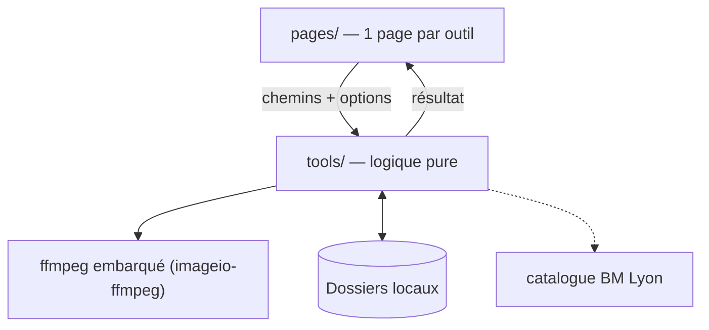

# Boîte à outils

**Application Streamlit locale qui regroupe, sous une navigation unique, une collection d'utilitaires personnels pour fichiers, médias et catalogues.**


Chaque outil est un onglet ; la logique métier vit dans le package `tools/`
(fonctions pures, testables), l'interface dans `pages/`.

## Architecture

Principe : **UI fine, logique pure**. Chaque page de `pages/` ne fait qu'appeler une
fonction de `tools/` (testable sans Streamlit) et afficher son résultat.



Détails : [docs/ARCHITECTURE.md](docs/ARCHITECTURE.md) (le COMMENT) et
[docs/CADRAGE.md](docs/CADRAGE.md) (le POURQUOI).

## Démarrage

**Prérequis** : Python `>=3.12` et [`uv`](https://docs.astral.sh/uv/).

```bash
uv sync                              # installe tout (~60 Mo, sans torch)
uv run playwright install chromium  # navigateur pour la vérification BM Lyon
```

Lancer l'application :

```bash
uv run streamlit run app.py
```

## Outils

| Catégorie | Outils |
|---|---|
| Audio | Normaliser des FLAC · Convertir · Extraire l'audio d'une vidéo · Découper · Normaliser le volume · Renommer / éditer les tags · Regrouper les singles |
| Images | Redimensionner / compresser · Convertir (dont HEIC) · Doublons · Renuméroter · Apparier des fonds d'écran · Auditer les fonds triés |
| Vidéo | Fusionner · Découper · Compresser · Convertir · Extraire des images · Créer un GIF |
| PDF | Extraire des pages · Fusionner · Supprimer / pivoter · Images ↔ PDF · Compresser · Protéger / déprotéger · Extraire le texte |
| Fichiers | Nettoyer les noms · Renommer en masse · Renommer depuis un CSV · Doublons · Ranger automatiquement · Statistiques · Comparer deux dossiers · Arborescence → Excel |
| Données | Convertir CSV ↔ Excel ↔ JSON · Nettoyer des lignes |
| Voix & langues | Lire un texte à voix haute (Kokoro) · Traduire, 200 langues (NLLB-200) · Transcrire un audio/vidéo + sous-titres (Whisper) — tout en local, sans PyTorch |
| Biblio | Trier des cotes · Vérifier la disponibilité BM Lyon |

> Les outils audio/vidéo utilisent le **ffmpeg embarqué** par `imageio-ffmpeg` (aucune
> installation système requise).
>
> La vérification BM Lyon nécessite en plus le navigateur Playwright :
> `uv run playwright install chromium`.
>
> La **synthèse vocale** (Kokoro) tourne en local sur CPU via `onnxruntime`
> (aucun PyTorch, espeak-ng embarqué). Le modèle (~340 Mo) se télécharge **au
> premier usage** depuis la page, puis est mis en cache. Accélération GPU NVIDIA
> facultative : `uv sync --extra gpu`.
>
> La **traduction** (NLLB-200) tourne en local via `ctranslate2` (aucun PyTorch ;
> `transformers` sert seulement de tokenizer). Le modèle (~600 Mo, 200 langues) se
> télécharge **au premier usage**, puis est mis en cache. Modèle NLLB sous licence
> **CC-BY-NC** (usage non commercial).
>
> La **transcription** (Whisper via `faster-whisper`) tourne en local sur
> CTranslate2 (aucun PyTorch ; `av` décode audio et vidéo). Le modèle choisi
> (jusqu'à ~1,6 Go pour `large-v3-turbo`) se télécharge **au premier usage**,
> puis est mis en cache. Modèle et moteur sous licence **MIT**.

## Tests

```bash
uv run pytest
```

Un fichier de test par module de `tools/` (logique pure ; le matching BM Lyon est testé
sans navigateur), plus `tests/test_pages.py` qui vérifie que **chaque page se rend sans
exception** (smoke-test via `streamlit.testing.v1.AppTest`).

## Structure du projet

```text
outils_maison/
├── app.py              # entrée Streamlit (navigation multipage)
├── tools/              # logique pure, sans Streamlit (testable)
│   ├── ffmpeg_utils.py #   accès au binaire ffmpeg embarqué
│   ├── audio.py        #   normalisation FLAC, extraction, renommage par tags
│   ├── musique.py      #   regroupement de singles
│   ├── images.py       #   redimensionner, convertir, dédupliquer, renuméroter
│   ├── fonds.py        #   appariement fonds d'écran SIFT+RANSAC
│   ├── video.py        #   fusionner, découper, compresser
│   ├── pdf.py          #   extraire, fusionner, pages, images ↔ PDF
│   ├── files.py        #   noms de fichiers, doublons, arborescence (+ annulation)
│   ├── data.py         #   conversions CSV / Excel / JSON
│   ├── tts.py          #   synthèse vocale locale (Kokoro / onnxruntime)
│   ├── traduction.py   #   traduction hors-ligne (NLLB-200 / CTranslate2)
│   ├── transcription.py #  transcription audio/vidéo (Whisper / faster-whisper)
│   ├── biblio.py       #   tri de cotes de bibliothèque
│   └── bm_lyon.py      #   disponibilité au catalogue BM Lyon (scraping)
├── pages/              # une page Streamlit par outil
├── tests/              # tests pytest (logique + rendu des pages)
├── notebooks_archive/  # notebooks d'origine, conservés en référence
└── docs/               # cadrage et architecture
```

## Documentation

- [docs/CADRAGE.md](docs/CADRAGE.md) — objectifs, périmètre, hypothèses, décisions (le POURQUOI).
- [docs/ARCHITECTURE.md](docs/ARCHITECTURE.md) — modules, flux, stack, sécurité, limites (le COMMENT).

## Licences & composants

Licences usuelles des briques utilisées — **à vérifier selon la version installée**
(certaines évoluent). En cas de doute : *à confirmer*.

| Composant | Rôle | Licence (usuelle) |
|---|---|---|
| Streamlit | Interface web | Apache-2.0 |
| pandas | Données / tableaux | BSD-3-Clause |
| openpyxl | Lecture/écriture Excel | MIT |
| pypdf | Manipulation PDF | BSD-3-Clause |
| PyMuPDF | Rendu / extraction PDF | AGPL-3.0 (ou licence commerciale) |
| moviepy | Traitement vidéo | MIT |
| imageio-ffmpeg | Binaire ffmpeg embarqué (transitif) | BSD-2-Clause (ffmpeg : LGPL/GPL) |
| mutagen | Tags audio | GPL-2.0-or-later |
| Pillow | Images | MIT-CMU (HPND) |
| pillow-heif | Support HEIC | *à confirmer* (BSD/Apache selon version) |
| ImageHash | Empreintes perceptuelles | BSD-2-Clause |
| tqdm | Barres de progression | MPL-2.0 / MIT |
| opencv-python | Vision (SIFT/RANSAC) | Apache-2.0 |
| Playwright | Navigateur pour scraping | Apache-2.0 |
| kokoro-onnx | Synthèse vocale (moteur ONNX) | MIT |
| Kokoro-82M | Modèle de voix (téléchargé) | Apache-2.0 |
| onnxruntime | Exécution du modèle (CPU/GPU) | MIT |
| espeakng-loader / phonemizer-fork | Phonémisation (espeak-ng embarqué) | GPL-3.0 (espeak-ng) |
| ctranslate2 | Traduction (moteur d'inférence) | MIT |
| transformers | Tokenizer de traduction | Apache-2.0 |
| sentencepiece | Tokenisation sous-mots | Apache-2.0 |
| NLLB-200 (distillé 600M) | Modèle de traduction (téléchargé) | **CC-BY-NC-4.0** (non commercial) |
| faster-whisper | Transcription (runtime CTranslate2) | MIT |
| av (PyAV) | Décodage audio/vidéo (ffmpeg) | BSD-3-Clause |
| Whisper (modèles) | Modèle de transcription (téléchargé) | MIT |
| **Ce projet** | Code applicatif | MIT — Copyright (c) 2026 floSa |
