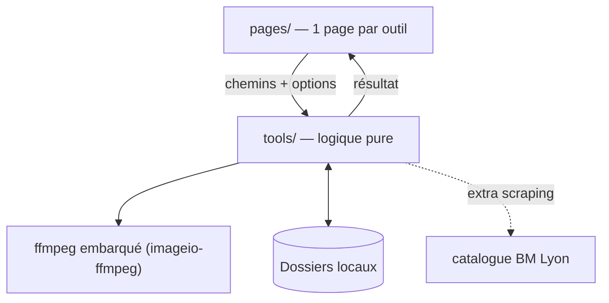

# 🧰 Boîte à outils

Petite application **Streamlit** regroupant des utilitaires locaux pour gérer
fichiers, médias et catalogues. Chaque outil est un onglet ; la logique métier
vit dans le package `tools/` (fonctions pures, testables), l'interface dans `pages/`.

## Installation

Projet géré avec [`uv`](https://docs.astral.sh/uv/).

```bash
uv sync                    # dépendances de base
uv sync --extra vision     # + appariement de fonds d'écran (OpenCV seul, ~60 Mo)
```

## Lancer l'application

```bash
uv run streamlit run app.py
```

## Structure

```
app.py            # entrée Streamlit (navigation multipage)
tools/            # logique pure, sans Streamlit (testable)
  ffmpeg_utils.py #   accès au binaire ffmpeg embarqué
  audio.py        #   normalisation FLAC, extraction, renommage par tags
  images.py       #   redimensionner, convertir, dédupliquer, renuméroter
  video.py        #   fusionner, découper, compresser
  pdf.py          #   extraire, fusionner, pages, images ↔ PDF
  files.py        #   noms de fichiers, doublons, arborescence (+ annulation)
  data.py         #   conversions CSV / Excel / JSON
  biblio.py       #   tri de cotes de bibliothèque
  fonds.py        #   appariement fonds d'écran SIFT+RANSAC (extra vision)
pages/            # une page Streamlit par outil
tests/            # tests pytest (logique + rendu des pages)
notebooks_archive/# notebooks d'origine, conservés en référence
```

## Architecture (vue rapide)

Principe : **UI fine, logique pure**. Chaque page de `pages/` ne fait qu'appeler une
fonction de `tools/` (testable sans Streamlit) et afficher son résultat.



Détails : [docs/ARCHITECTURE.md](docs/ARCHITECTURE.md) (le COMMENT) et
[docs/CADRAGE.md](docs/CADRAGE.md) (le POURQUOI).

## Outils

| Catégorie | Outils |
|---|---|
| 🎵 Audio | Normaliser des FLAC · Convertir · Extraire l'audio d'une vidéo · Découper · Normaliser le volume · Renommer / éditer les tags · Regrouper les singles |
| 🖼️ Images | Redimensionner / compresser · Convertir (dont HEIC) · Doublons · Renuméroter · Apparier des fonds d'écran¹ · Auditer les fonds triés¹ |
| 🎬 Vidéo | Fusionner · Découper · Compresser · Convertir · Extraire des images · Créer un GIF |
| 📄 PDF | Extraire des pages · Fusionner · Supprimer / pivoter · Images ↔ PDF · Compresser · Protéger / déprotéger · Extraire le texte |
| 📁 Fichiers | Nettoyer les noms · Renommer en masse · Renommer depuis un CSV · Doublons · Ranger automatiquement · Statistiques · Comparer deux dossiers · Arborescence → Excel |
| 🔤 Données | Convertir CSV ↔ Excel ↔ JSON · Nettoyer des lignes |
| 📚 Biblio | Trier des cotes · Vérifier la disponibilité BM Lyon² |

> Les outils audio/vidéo utilisent le **ffmpeg embarqué** par `imageio-ffmpeg` (aucune
> installation système requise).
>
> ¹ L'appariement de fonds d'écran (paysage ↔ portrait, par SIFT + RANSAC) nécessite
> l'extra `vision` : `uv sync --extra vision`.
>
> ² La vérification BM Lyon nécessite l'extra `scraping` :
> `uv sync --extra scraping` puis `uv run playwright install chromium`.

## Tests

```bash
uv run pytest
```

Un fichier de test par module de `tools/` (logique pure ; le matching BM Lyon est testé
sans navigateur), plus `tests/test_pages.py` qui vérifie que **chaque page se rend sans
exception** (smoke-test via `streamlit.testing.v1.AppTest`).

## Documentation

- [docs/CADRAGE.md](docs/CADRAGE.md) — objectifs, périmètre, hypothèses, décisions (le POURQUOI).
- [docs/ARCHITECTURE.md](docs/ARCHITECTURE.md) — modules, flux, stack, sécurité, limites (le COMMENT).

## Licences & composants

Licences usuelles des briques utilisées — **à vérifier selon la version installée**
(certaines évoluent). En cas de doute : *à confirmer*.

| Composant | Rôle | Licence (usuelle) |
|---|---|---|
| Streamlit | Interface web | Apache-2.0 |
| pandas | Données / tableaux | BSD-3-Clause |
| openpyxl | Lecture/écriture Excel | MIT |
| pypdf | Manipulation PDF | BSD-3-Clause |
| PyMuPDF | Rendu / extraction PDF | AGPL-3.0 (ou licence commerciale) |
| moviepy | Traitement vidéo | MIT |
| imageio-ffmpeg | Binaire ffmpeg embarqué (transitif) | BSD-2-Clause (ffmpeg : LGPL/GPL) |
| mutagen | Tags audio | GPL-2.0-or-later |
| Pillow | Images | MIT-CMU (HPND) |
| pillow-heif | Support HEIC | *à confirmer* (BSD/Apache selon version) |
| ImageHash | Empreintes perceptuelles | BSD-2-Clause |
| tqdm | Barres de progression | MPL-2.0 / MIT |
| opencv-python (extra `vision`) | Vision (SIFT/RANSAC) | Apache-2.0 |
| Playwright (extra `scraping`) | Navigateur pour scraping | Apache-2.0 |
| **Ce projet** | Code applicatif | MIT — Copyright (c) 2026 floSa |
