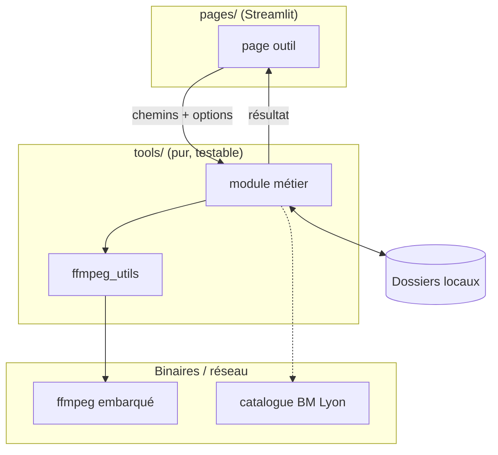

# Architecture — Boîte à outils

Doc technique (le **COMMENT**). Le **POURQUOI** est dans [CADRAGE.md](CADRAGE.md).
Sections numérotées, séparées par `---`.

## 1. Vue d'ensemble

Application **Streamlit multipage** locale. Un principe structurant : **séparation
stricte UI / logique**.

- La **logique métier** vit dans le package [`tools/`](../tools/) : fonctions pures,
  sans aucun `import streamlit`, donc testables en isolation.
- L'**interface** vit dans [`pages/`](../pages/) : une page Streamlit par outil, qui ne
  fait que collecter des chemins/options, appeler `tools/`, puis afficher le résultat.
- Le **point d'entrée** [`app.py`](../app.py) déclare la navigation via `st.navigation`
  / `st.Page` (9 rubriques + Accueil).

Tout traite des **dossiers/fichiers locaux** (chemins saisis en clair, ex. `M:/musiques`).
Aucune donnée ne sort de la machine, sauf l'outil « BM Lyon » qui interroge un site public.
L'outil de **synthèse vocale** télécharge son modèle une seule fois depuis GitHub, puis
fonctionne hors-ligne.

---

## 2. Modules de logique (`tools/`)

| Module | Rôle | Dépendances clés |
|---|---|---|
| [`ffmpeg_utils.py`](../tools/ffmpeg_utils.py) | Accès au binaire **ffmpeg embarqué** (`imageio-ffmpeg`), lancement de commandes, durée média | `imageio-ffmpeg`, `subprocess` |
| [`audio.py`](../tools/audio.py) | Normalisation FLAC, conversion, extraction, découpe, volume, tags | `mutagen`, ffmpeg |
| [`musique.py`](../tools/musique.py) | Regroupement de singles | `<à confirmer>` |
| [`images.py`](../tools/images.py) | Redimensionner, convertir (dont HEIC), dédupliquer, renuméroter | `pillow`, `pillow-heif`, `imagehash` |
| [`fonds.py`](../tools/fonds.py) | Appariement fonds d'écran paysage↔portrait (SIFT + RANSAC), audit, déduplication | `opencv-python`, `imagehash`, `pillow` |
| [`video.py`](../tools/video.py) | Fusionner, découper, compresser, convertir, extraire images, GIF | `moviepy`, ffmpeg |
| [`pdf.py`](../tools/pdf.py) | Extraire/fusionner/pivoter des pages, images↔PDF, compresser, protéger, texte | `pypdf`, `pymupdf` |
| [`files.py`](../tools/files.py) | Noms (slugify), doublons (SHA-1), arborescence→Excel, rangement, stats, comparaison, renommage CSV | `pandas`, `openpyxl` |
| [`data.py`](../tools/data.py) | Conversions CSV / Excel / JSON, nettoyage de lignes | `pandas`, `openpyxl` |
| [`biblio.py`](../tools/biblio.py) | Tri de cotes de bibliothèque | `<à confirmer>` |
| [`bm_lyon.py`](../tools/bm_lyon.py) | Vérification de disponibilité au catalogue BM Lyon (scraping) | `playwright`, `difflib` |
| [`tts.py`](../tools/tts.py) | Synthèse vocale locale (voix, vitesse, CPU/GPU), téléchargement du modèle | `kokoro-onnx`, `onnxruntime`, `numpy` |

> Les 41 pages de [`pages/`](../pages/) sont de fines enveloppes UI au-dessus de ces
> modules (une page = un outil, cf. la navigation dans [`app.py`](../app.py)).

---

## 3. Stack technologique

| Couche | Technologie | Version (contrainte `pyproject.toml`) |
|---|---|---|
| Interface web | Streamlit | `>=1.40` |
| Tableurs / données | pandas · openpyxl | `>=2.2` · `>=3.1` |
| PDF | pypdf · PyMuPDF | `>=5.0` · `>=1.28.0` |
| Vidéo / audio | moviepy · ffmpeg (via imageio-ffmpeg) | `>=2.0` · embarqué |
| Tags audio | mutagen | `>=1.47` |
| Images | Pillow · pillow-heif · ImageHash | `>=11.0` · `>=1.4.0` · `>=4.3.2` |
| Progression | tqdm | `>=4.67` |
| Vision | opencv-python | `>=4.10` |
| Scraping | Playwright | `>=1.40` |
| Synthèse vocale | kokoro-onnx · onnxruntime (modèle Kokoro-82M) | `>=0.4` · CPU (extra `gpu`) |
| Runtime | Python | `>=3.12` |
| Gestion projet | uv | `uv.lock` présent |

`imageio-ffmpeg` (fournisseur du binaire ffmpeg) n'est pas déclaré explicitement dans
`pyproject.toml` : il arrive en dépendance transitive (probablement via `moviepy`).
`<à confirmer>` : le fixer en dépendance directe si l'on veut garantir sa présence.

---

## 4. Flux de bout en bout

Parcours type d'un outil de traitement de médias :

1. L'utilisateur choisit un outil dans la barre latérale (navigation `app.py`).
2. La page (`pages/<outil>.py`) collecte un chemin de dossier/fichier et des options.
3. Beaucoup d'outils **prévisualisent** d'abord (calcul sans effet de bord), puis
   **appliquent** sur confirmation. Ex. `files.previsualiser()` → `files.appliquer()`.
4. La logique `tools/` exécute le traitement (ffmpeg, Pillow, pypdf…) et retourne un
   résultat structuré (dataclasses, DataFrame, dict).
5. La page affiche le résultat ; certains outils écrivent un **journal d'annulation**.

---

## 5. Sécurité de l'exécution (garde-fous)

L'app agit directement sur le système de fichiers de l'utilisateur ; les protections
sont donc des garde-fous d'**intégrité des données**, pas d'isolation réseau.

| Garde-fou | Effet | Source |
|---|---|---|
| Prévisualisation avant application | L'utilisateur voit les renommages/déplacements avant qu'ils aient lieu | `files.py`, `fonds.py` |
| Journal d'annulation JSON | `annuler()` restaure les noms/emplacements d'origine | `.renommage_undo.json`, `.dedup_undo.json` |
| Non-écrasement | Une cible déjà existante est ignorée, jamais écrasée | `files.appliquer()` |
| ffmpeg embarqué | Pas de binaire système requis ni de PATH à faire confiance | `ffmpeg_utils.py` |
| Imports paresseux des extras | OpenCV / Playwright / Kokoro chargés seulement à l'usage | `fonds.py`, `bm_lyon.py`, `tts.py` |
| Téléchargement atomique du modèle TTS | Écrit dans `*.part` puis renomme : jamais de modèle à moitié écrit | `tts.py` |

---

## 6. Décisions d'architecture

- **Séparer `tools/` (pur) et `pages/` (UI)** **plutôt que** mettre la logique dans les
  pages Streamlit, **parce que** la logique redevient testable sans lancer Streamlit
  (cf. `tests/`, dont `test_pages.py` qui ne fait qu'un smoke-test de rendu).
  *Limite* : un peu de code d'enrobage répété dans chaque page.
- **ffmpeg via `imageio-ffmpeg`** **plutôt que** ffmpeg système, **parce que** l'app
  fonctionne sans installation externe.
  *Limite* : dépend d'une version de ffmpeg figée par le paquet.
- **Extras optionnels (`vision`, `scraping`)** **plutôt que** dépendances de base,
  **parce que** OpenCV (~60 Mo) et Playwright (+ navigateur) sont lourds et rarement
  nécessaires. Imports paresseux pour garder la logique testable sans eux.
  *Limite* : un outil non installé échoue à l'usage plutôt qu'au démarrage.
- **Appariement de fonds par SIFT + RANSAC** **plutôt que** un CNN/deep-learning,
  **parce que** la mise en correspondance géométrique suffit (le portrait est un
  recadrage du paysage) et évite `torch`. *Limite* : moins robuste sur des recadrages
  très transformés. (Détails dans la docstring de [`fonds.py`](../tools/fonds.py).)
- **Scraping BM Lyon par recherche de l'artiste seul** (puis filtrage), **parce que**
  l'album précis est mal indexé au catalogue ; matching tolérant (sous-ensemble de nom,
  découpe sur le 1er `" - "`). *Limite* : dépend du HTML du site, fragile aux
  changements (cf. docstring de [`bm_lyon.py`](../tools/bm_lyon.py)).
- **Synthèse vocale par Kokoro (via `kokoro-onnx`)** **plutôt que** Piper, Chatterbox ou
  XTTS, **parce que** Kokoro donne la voix la plus naturelle tout en tournant sur CPU via
  `onnxruntime` **sans PyTorch** (Chatterbox/XTTS imposent `torch` et visent le GPU), et
  que la phonémisation française passe par espeak-ng **embarqué** (`espeakng-loader`,
  aucune installation système). *Limite* : Kokoro n'offre qu'**une** voix française
  (`ff_siwis`, grade B-) ; pour de la variété de voix FR, Piper serait le complément.
  Le modèle (~340 Mo) n'est pas versionné : il est téléchargé au premier usage.

---

## 7. Limites connues & pistes

| Aspect | Limitation / État | Recommandation |
|---|---|---|
| Scraping BM Lyon | Couplé au HTML du catalogue, `time.sleep` codés en dur, best-effort | Surveiller les changements de sélecteurs ; garder le matching testé |
| Chemins | Saisis en clair, orientés Windows (`M:/…`) | OK pour usage perso ; pas de validation forte |
| `imageio-ffmpeg` | Dépendance transitive non déclarée | La fixer en dépendance directe |
| Tests des pages | Smoke-test de rendu à entrées vides uniquement | Ajouter des tests de bout en bout sur données factices si besoin |
| Synthèse vocale (français) | Une seule voix (`ff_siwis`, grade B-) ; modèle ~340 Mo à télécharger au 1er usage | Ajouter Piper en second moteur si plusieurs voix FR deviennent nécessaires |
